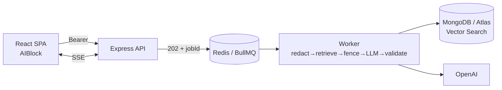

# Portfolio Presentation — AI Operations Copilot

Ten-slide deck. Each slide is a section; speaker notes in the blockquotes.

---

## Slide 1 — Title

# 🛠️ AI Operations Copilot
### Grounded, async AI for on-call engineers

Multi-tenant SaaS · React · Express · MongoDB Atlas Vector Search · Redis/BullMQ · OpenAI · TypeScript

`npm audit: 0 vulnerabilities` · `CI: green (real DB)` · feature-complete & hardened

> A production-grade reference implementation — the engineering *around* the LLM,
> not just an API call.

---

## Slide 2 — Problem

**On-call engineers spend most of an incident triaging, not fixing.**

- Read the ticket → search runbooks → correlate logs → write the RCA.
- Generic LLM chatbots don't help: they **hallucinate**, don't know *your*
  runbooks, and can't be trusted enough to act on during an outage.
- And it has to be safe in a **shared, multi-tenant** environment with **real PII**.

> The bar isn't "an LLM answered." It's "an answer I can trust enough to act on,
> grounded in our own data, in a system that won't leak one customer's data to
> another."

---

## Slide 3 — Architecture



- **API enqueues, worker processes** — long LLM calls never block requests.
- One pipeline, three features. Results stream over **SSE**.
- **Degrades without MongoDB**; mock mode runs the whole flow with no API key.

> Two processes sharing Redis + Mongo. Async-first because generative calls take
> 10–60 seconds.

---

## Slide 4 — Ticket Summarization

**Ticket → cited summary → human edit → save.**

- `POST /tickets/:id/summarize` → job → SSE → `GroundedResult<TicketSummary>`
  (headline, impact, next actions) + a source citation + confidence.
- Rendered in `AIBlock`: "verify before acting," editable, then `PUT …/summary`
  (upsert, one per ticket, `editedByHuman` flag).

> Fast tier (`gpt-4o-mini`). The point: a draft a human approves, with an audit
> trail of whether they edited it.

---

## Slide 5 — SOP Search (RAG)

**Upload runbooks → chunk → embed → vector search → grounded answer.**

```
upload → extract → chunk (overlap) → embed (1536-dim) → Atlas Vector Search
query → redact → embed → $vectorSearch (tenant-filtered) → top-k → answer w/ citations
```

- Answers **only** from retrieved chunks; honest "no source found" when empty.
- MongoDB Atlas Vector Search (reuse the datastore) + cosine fallback for dev.

> RAG is what makes it trustworthy — it cites *your* runbook section, not the
> model's imagination.

---

## Slide 6 — RCA Generation

**Incident + logs → retrieve SOPs → cited root-cause document.**

- `POST /rca/generate` → redact incident + log → retrieve SOP chunks → fence
  everything → `gpt-4o` (JSON, schema-validated) → `RcaDocument` (root cause,
  contributing factors, timeline, remediation) with **log + SOP citations**.
- Human edits all fields, then `POST /rca` persists.

> The most composite feature — it reuses the SOP retrieval and the redaction +
> grounding from the other two.

---

## Slide 7 — Security

`npm audit: 0` · no open P1/P2

- 🔒 **Fail-closed PII redaction** before every OpenAI call (chat + embeddings)
- 🛡️ **Prompt-injection fencing** (per-call nonce); output never executed
- 🏢 **Multi-tenant isolation** — every query, Redis key, job-ownership check
- 🔑 **JWT HS256 pinned** + **signed 60s job-scoped SSE tokens**
- 🚦 **Rate limiting** (per-IP + per-tenant) + **token budget meter**
- 🧱 **NoSQL-injection** closed (zod + ObjectId validation)

> Defense in depth around the LLM. Removed an unused dependency that pulled a HIGH
> SSRF chain → audit clean.

---

## Slide 8 — CI/CD and Testing

```
npm ci → typecheck (tsc -b) → tests → web build
services: mongo:7 + redis:7   →  integration tests run on a REAL database
```

- **24 unit + 3 integration tests**, 0 fail; integration verified by Mongo
  container logs (live collection + unique-index creation).
- Layered: hermetic unit → Redis-gated pipeline → DB-gated integration.
- Green on every push; concurrency cancels superseded runs.

> Real-DB verification in CI — not mocks all the way down.

---

## Slide 9 — Scalability

- **Stateless API + horizontally-scaled workers** (concurrency 4 each).
- Queue, budget meter, and rate limiter are **Redis-shared** → limits stay correct
  across replicas.
- Retrieval **offloaded to Atlas Vector Search** (not app memory).
- Backpressure & cost control: bounded concurrency, retries w/ backoff, idempotency
  keys, per-tenant token budgets.

> Scale throughput by adding worker replicas; correctness of limits/metering
> doesn't degrade because the state is in Redis.

---

## Slide 10 — Results & Future Roadmap

**Delivered:** the grounded Core-3, reviewed (no open P1/P2), hardened (signed SSE,
rate limits, budget meter, secret guard), CI-gated against a real DB, `npm audit` 0,
and fully documented (13+ docs).

**Next — hardening:** live Atlas vector-search run · secrets manager · observability
· security headers · DLQ · backups.

**Next — v2 agents:** log-stream analysis · command-recommendation (advisory-only) ·
email drafting · ChatOps assistant · auto-remediation advisor.

> Production-ready application core; remaining items are operational hardening, not
> correctness or security blockers.

---

_Repo: [docs/](docs/) · [PROJECT_SHOWCASE.md](PROJECT_SHOWCASE.md) ·
[INTERVIEW_QA.md](INTERVIEW_QA.md) · [FINAL_REPORT.md](FINAL_REPORT.md)_
