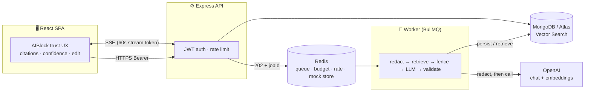

<div align="center">

# 🛠️ AI Operations Copilot

**Grounded, async AI for on-call engineers** — turns incident tickets, logs, and
runbooks into **cited, confidence-scored** summaries, runbook answers, and
root-cause analyses, with a human-in-the-loop edit-before-save workflow.

[](https://github.com/Prasadpolnatii/Claude/actions/workflows/ci.yml)


</div>

---

## Project overview

On-call engineers lose time triaging tickets, hunting through runbooks, and
writing up incidents. **AI Operations Copilot** compresses that work — but unlike a
naive chatbot, every answer is **grounded** in the team's own data (it cites its
sources), carries a **confidence score**, is labelled *"verify before acting,"* and
must be **reviewed and edited by a human before it's saved.**

The interesting engineering is everything around the LLM that makes it safe and
operable: an **async job queue with SSE streaming**, a **fail-closed PII redaction
proxy**, **prompt-injection defense**, **multi-tenant isolation**, **Redis-backed
rate limiting + token budgets**, **signed short-lived stream tokens**, and
**MongoDB Atlas Vector Search** for retrieval — shipped with CI that runs
integration tests against a real database and **0 dependency vulnerabilities**.

## Features

| Feature | What it does |
|---------|-------------|
| 🎫 **Ticket Summarization** | Summarizes a ticket (headline, impact, next actions), cited to the source. |
| 📚 **SOP Search (RAG)** | Upload runbooks (PDF/.md/.txt) → chunk → embed → Atlas Vector Search → grounded answer with citations. |
| 🔍 **RCA Generation** | Incident + log snippet → retrieves SOPs → produces a cited root-cause document. |

Every output streams over SSE, shows **citations + a confidence score**, and is
**editable by a human before save**.

### Operations Dashboard

A full on-call dashboard sits on top of the same multi-tenant API, auth, and SSE
infrastructure:

| Feature | What it does |
|---------|-------------|
| 🚨 **Incidents** | List with **severity (SEV1–4) + status filters**, detail view with a chronological **timeline**, acknowledge / resolve / add-note (all audited). |
| 💓 **Application health** | Per-service health **cards** (p95 latency, error rate, uptime, req/min) with status derived from live SLO numbers. |
| 📟 **Real-time alerts** | Live alert feed over **SSE** (firing/resolved), manual resolve. A pub/sub bus accepts alerts from a monitoring webhook (or the built-in demo simulator). |
| 📊 **Queue monitoring** | Depth / in-flight / throughput / oldest-item age per queue, including the **live BullMQ** generative queue read straight from Redis. |
| 📖 **Knowledge base** | Searchable runbook/article viewer (dependency-free markdown). |
| 🌓 **Dark mode** | Persisted dark/light theme toggle. |
| 🔐 **Role-based access** | `engineer` vs `admin`; the **audit log** is admin-only, enforced server-side (`requireRole`) and hidden in the UI. |
| 🧾 **Audit log** | Immutable who-did-what trail for every mutating action (admin-only). |
| 📱 **Responsive UI** | Sidebar collapses to a top nav; tables scroll on narrow screens. |
| ⭳ **Export to PDF** | Incident reports render to a print-optimized layout and export via the browser's native print-to-PDF (timeline + related alerts + MTTR). |

Run it: `npm run seed` (prints **admin** and **engineer** dev JWTs) → `npm run dev`
→ open the web app and paste a token. The seed populates incidents, application
health, alerts, queues, and knowledge articles. **Full local setup:
[RUNNING.md](RUNNING.md).** **Deploy a public URL: [DEPLOY.md](DEPLOY.md)** (Render/Railway).

> **LLM provider note:** the dashboard surface is pure data/CRUD and does not add
> any LLM calls; the existing AI features (summary / SOP search / RCA) keep their
> original OpenAI-or-mock provider untouched.

## Architecture diagram



Two processes share Redis + MongoDB: the API enqueues generative work and returns
`202 + jobId`; the worker runs the LLM and streams results back over SSE. Full
diagrams in [docs/ARCHITECTURE.md](docs/ARCHITECTURE.md).

## Tech stack

| Layer | Tech |
|-------|------|
| Frontend | React 18, Vite, TypeScript |
| API | Express, TypeScript (ESM) |
| Async | BullMQ + Redis (queue, events) |
| Data | MongoDB / Atlas Vector Search (Mongoose) |
| AI | OpenAI (chat + embeddings), RAG |
| Auth | JWT (HS256), signed SSE tokens |
| Tooling | npm workspaces monorepo, GitHub Actions CI |

## Setup instructions

**Requirements:** Node 20+, Docker (for local Mongo/Redis).

```bash
docker compose up -d            # Mongo + Redis
npm install
cp .env.example .env            # LLM_MODE=mock by default → no key, no spend
npm run seed                    # seeds a demo tenant, prints a dev JWT
npm run dev                     # API :4000 + web :5173
npm run worker                  # second terminal
# open http://localhost:5173, paste the JWT
```

Mock mode runs the **entire** flow (including SOP RAG via a Redis store) with no
database and no API key. Flip to live with `LLM_MODE=openai` + `OPENAI_API_KEY`.
For MongoDB Atlas, see [docs/DEPLOYMENT.md](docs/DEPLOYMENT.md).

## Environment variables

Validated by zod at boot. Full table: [docs/ENVIRONMENT_VARIABLES.md](docs/ENVIRONMENT_VARIABLES.md).

| Variable | Default | Purpose |
|----------|---------|---------|
| `LLM_MODE` | `mock` | `mock` (no key/spend) or `openai` |
| `OPENAI_API_KEY` | — | required when `LLM_MODE=openai` |
| `MONGODB_URI` | `mongodb://localhost:27017/ops_copilot` | Mongo / Atlas SRV string |
| `REDIS_URL` | `redis://localhost:6379` | queue, budget, rate limit, mock store |
| `JWT_SECRET` | — (min 16) | HS256 secret; placeholder rejected in prod |
| `TENANT_DAILY_TOKEN_BUDGET` | `2000000` | per-tenant daily token cap |

## Screenshots

> _Add screenshots/GIFs here for the portfolio showcase._

| Incident Workspace (Ticket Summarization) | SOP Search (RAG) | RCA Generation |
|---|---|---|
| _`docs/images/ticket-summary.png`_ | _`docs/images/sop-search.png`_ | _`docs/images/rca.png`_ |

Each shows the `AIBlock`: streamed output, **citations**, a **confidence score**,
the "verify before acting" badge, and the **edit-before-save** flow.

## API overview

17 endpoints across `jobs`, `tickets`, `sops`, `rca`, + health. Generative work is
async (`202 + jobId` → SSE). Full reference: [docs/API_REFERENCE.md](docs/API_REFERENCE.md).

```
POST /api/jobs                      enqueue a generative job
GET  /api/jobs/:id/stream?t=        SSE stream (signed token)
POST /api/tickets/:id/summarize     → jobId   |  PUT /api/tickets/:id/summary
POST /api/sops/upload               runbook → chunk → embed → store
POST /api/sops/search               grounded RAG answer → jobId
POST /api/rca/generate              → jobId   |  POST /api/rca  (persist)
```

## Security features

`npm audit`: **0 vulnerabilities**. Full report: [docs/SECURITY.md](docs/SECURITY.md).

- 🔒 **Fail-closed PII redaction** before every OpenAI call (chat + embeddings)
- 🛡️ **Prompt-injection defense** — per-call nonce fencing; output never executed
- 🏢 **Multi-tenant isolation** — every query, Redis key, and job-ownership check
- 🔑 **JWT (HS256, pinned)** + **signed 60s job-scoped SSE tokens**
- 🚦 **Rate limiting** (Redis, per-IP + per-tenant) + **token budget meter**
- 🧱 **NoSQL-injection protection** (zod + ObjectId validation)

## Future roadmap

- **Hardening** ([docs/ROADMAP.md](docs/ROADMAP.md)): live Atlas vector-search run,
  secrets manager, observability, security headers, DLQ, backups.
- **v2 agents** ([docs/FUTURE_ROADMAP.md](docs/FUTURE_ROADMAP.md)): log-stream
  analysis, command-recommendation agent, email drafting, ChatOps, auto-remediation
  advisor.

## Documentation

[Architecture](docs/ARCHITECTURE.md) · [API](docs/API_REFERENCE.md) ·
[Database](docs/DATABASE_SCHEMA.md) · [Queue/Worker](docs/QUEUE_AND_WORKER_FLOW.md) ·
[Security](docs/SECURITY.md) · [Deployment](docs/DEPLOYMENT.md) ·
[Env Vars](docs/ENVIRONMENT_VARIABLES.md) · [Troubleshooting](docs/TROUBLESHOOTING.md) ·
[Roadmap](docs/ROADMAP.md)

**Portfolio:** [Project Showcase](PROJECT_SHOWCASE.md) ·
[Interview Q&A](INTERVIEW_QA.md) · [Resume Bullets](RESUME_BULLETS.md) ·
[Presentation](PORTFOLIO_PRESENTATION.md) · [Final Report](FINAL_REPORT.md)

## Status & tests

```bash
npm run typecheck    # tsc -b across all workspaces
npm test             # 24 unit + 3 integration (real DB in CI)
```

**Feature-complete and frozen.** Core-3 built, reviewed (no open P1/P2), hardened,
CI-gated against a real database, and fully documented.

## License

MIT.
