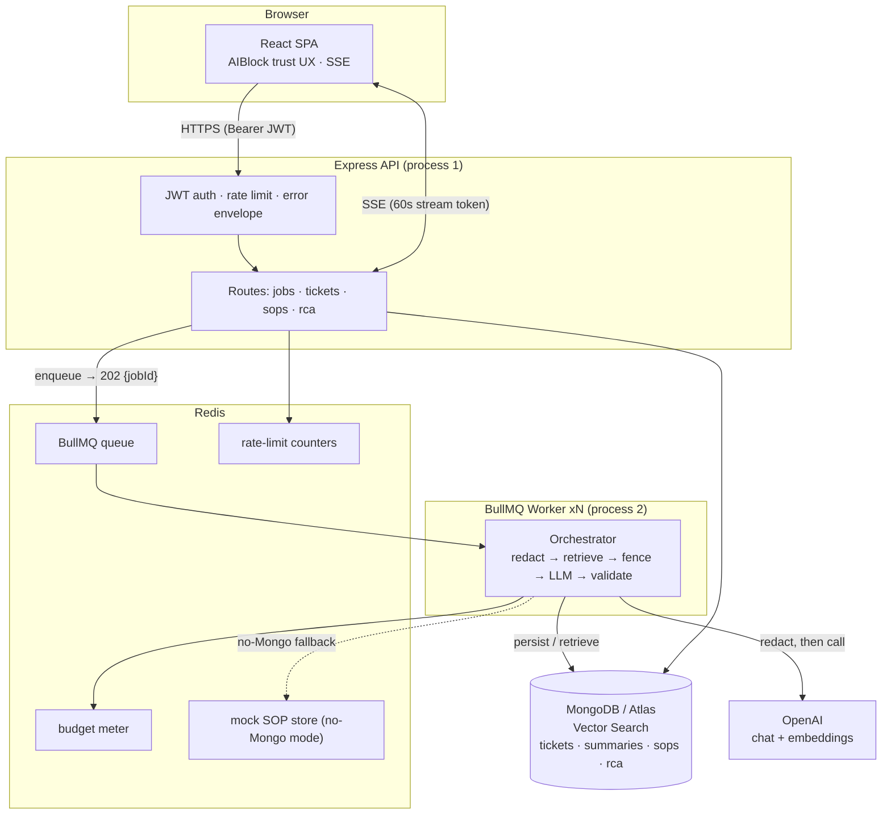
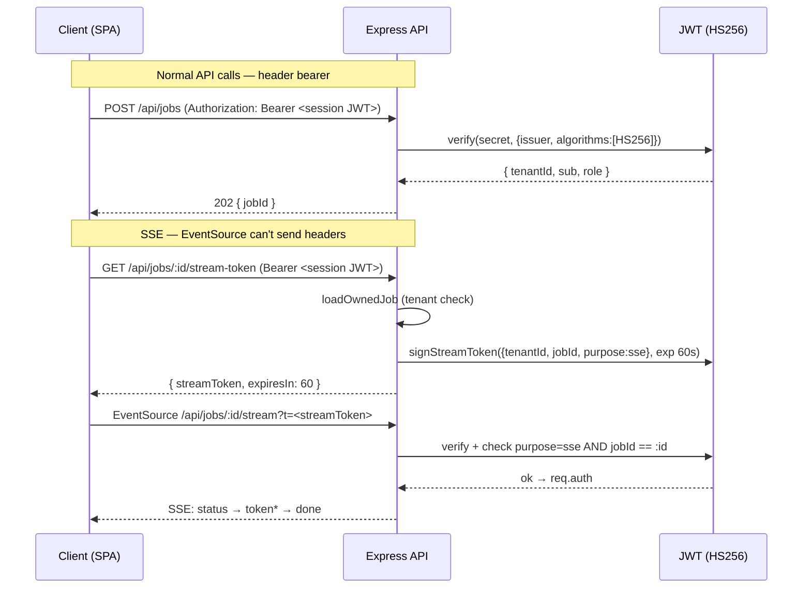
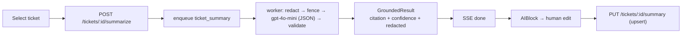
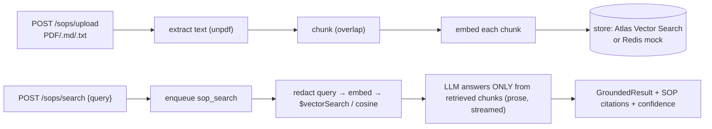
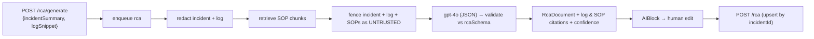

# Architecture

Grounded, async AI copilot for on-call engineers. Three features
(Ticket Summarization, SOP Search, RCA Generation) share one architecture:
**async job → SSE stream → grounded result → human edit → save**.

## System architecture



**Why two processes?** Generative calls take 10–60 s. Running them in an Express
handler would exhaust the event loop and time out. The API stays responsive and
returns `202 + jobId`; the worker does the slow work and streams results back via
SSE. They communicate only through Redis (queue + events) and MongoDB.

**Graceful degradation.** The API boots without MongoDB: health + jobs work, SOP
search uses a Redis-backed store, and Mongo-only routes return a clean
`503 db_unavailable`. Mock LLM mode runs the full flow with no API key.

## Folder structure

```
ai-ops-copilot/
├── package.json                      # npm workspaces root (dev/worker/seed/test/typecheck)
├── docker-compose.yml                # Mongo + Redis for local dev
├── tsconfig*.json                    # composite TS project references
├── .github/workflows/ci.yml          # typecheck + tests (real Mongo+Redis) + web build
├── packages/
│   └── shared/                       # @ops-copilot/shared — API↔web contract
│       └── src/index.ts              # ApiError, Job, GroundedResult, Citation, *Summary, RcaDocument
└── apps/
    ├── api/                          # @ops-copilot/api
    │   ├── atlas/sop_vector_index.json   # Atlas Vector Search index definition
    │   ├── evals/injection.test.ts       # redaction/injection red-team suite
    │   └── src/
    │       ├── index.ts              # Express bootstrap, route mounting, limiter
    │       ├── config.ts             # zod-validated env, secret/placeholder guards
    │       ├── seed.ts               # demo tenant + dev JWT
    │       ├── auth/jwt.ts           # requireAuth, signStreamToken, requireStreamToken
    │       ├── db/
    │       │   ├── mongo.ts          # lazy connect, warm connect + index bootstrap
    │       │   └── indexes.ts        # ensureCollectionIndexes / ensureVectorSearchIndex
    │       ├── features/
    │       │   ├── redaction.ts      # fail-closed PII/secret scrubber
    │       │   ├── chunker.ts        # overlapping document chunker
    │       │   ├── docExtract.ts     # PDF/text extraction (unpdf)
    │       │   ├── sopStore.ts       # dual-mode SOP store (Atlas / Redis)
    │       │   ├── vectorMath.ts     # pure cosine + cosineRank
    │       │   ├── audit.ts          # redaction audit + Redis budget meter
    │       │   ├── redisStore.ts     # shared lazyConnect Redis client
    │       │   ├── summary.ts        # ticket-summary save schema
    │       │   └── rca.ts            # RCA generate/save schemas
    │       ├── llm/
    │       │   ├── client.ts         # OpenAI client + deterministic mock
    │       │   └── orchestrator.ts   # summarizeTicket / answerFromSops / generateRca
    │       ├── middleware/
    │       │   ├── error.ts          # uniform envelope + asyncHandler
    │       │   ├── requireMongo.ts   # lazy Mongo gate (503 when down)
    │       │   └── rateLimit.ts      # Redis fixed-window limiter
    │       ├── models/index.ts       # Mongoose schemas (tenant-scoped)
    │       ├── queue/
    │       │   ├── queue.ts          # BullMQ queue + events + connection
    │       │   └── worker.ts         # job processor + failure classification
    │       ├── routes/               # jobs.ts · tickets.ts · sops.ts · rca.ts
    │       ├── scripts/createIndexes.ts  # one-shot index creation
    │       └── integration/realdb.test.ts # real-DB integration tests
    └── web/                          # @ops-copilot/web (React + Vite)
        └── src/
            ├── App.tsx               # tabs: Incident Workspace · SOP Search · RCA
            ├── api/client.ts         # typed API client + SSE
            ├── hooks/useJob.ts       # useJobStream — submit + consume SSE
            ├── components/           # AIBlock · EditableSummary · EditableRca
            └── pages/                # IncidentWorkspace · SopSearch · RcaPage
```

## Authentication flow



The session JWT (12 h) is **never** put in a URL. The SSE route takes a separate
60 s, single-purpose token bound to one job id — a leaked stream URL expires in a
minute and unlocks only that job's stream.

## Feature flows

### Ticket Summarization



### SOP Search (RAG)



### RCA Generation



Detailed **sequence diagrams** for all three are in
[QUEUE_AND_WORKER_FLOW.md](QUEUE_AND_WORKER_FLOW.md).

## Key design decisions

- **Async-first** — every generative endpoint returns `202 + jobId`; results
  stream over SSE. No LLM work in request handlers.
- **Grounding is the product** — every answer carries citations + a confidence
  score; the orchestrator validates LLM JSON against zod schemas, so a malformed
  response becomes a clean error instead of a broken object.
- **Fail-closed redaction** — PII/secrets are scrubbed before *every* OpenAI call
  (chat and embeddings); redaction failure aborts the call.
- **Defense in depth for injection** — untrusted content is fenced with a
  per-call random nonce and never reaches a command executor.
- **Multi-tenant from day one** — `tenantId` on every document, every query, and
  every Redis key; job ownership is checked before streaming.
- **Dual-mode storage** — Atlas Vector Search when Mongo is up; a Redis store
  shared across API + worker when it's down (mock mode), so the whole flow is
  demoable with no database.
