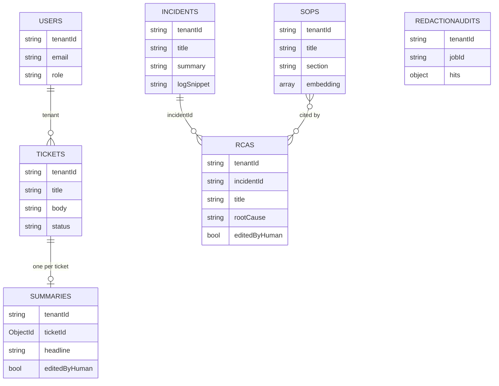

# Database Schema

MongoDB via Mongoose. **Every document is tenant-scoped** (`tenantId`, indexed).
All collections carry `createdAt` / `updatedAt`. Redis holds ephemeral state
(queue, budget, rate limits, the no-Mongo SOP store).

## Entity relationships



## Collections

### `users`
| Field | Type | Notes |
|-------|------|-------|
| tenantId | string | indexed |
| email | string | |
| role | enum | `engineer` \| `admin` |

Index: **unique (tenantId, email)**.

### `tickets`
| Field | Type |
|-------|------|
| tenantId | string (indexed) |
| externalId | string? |
| title | string |
| body | string (required) |
| status | string (default `open`) |

### `incidents`
| Field | Type |
|-------|------|
| tenantId | string (indexed) |
| title | string (required) |
| summary | string? |
| logSnippet | string? |
| ticketId | ObjectId → Ticket |

### `sops` — the RAG knowledge base
| Field | Type | Notes |
|-------|------|-------|
| tenantId | string (indexed) |
| title | string (required) |
| section | string | chunk index/section |
| text | string (required) | the chunk |
| **embedding** | number[1536] | vector |
| embeddingVersion | number | for re-index invalidation |

Indexes: `tenantId`; **Atlas Vector Search `sop_vector_index`** — see below.

### `summaries` — persisted, human-editable ticket summaries
| Field | Type |
|-------|------|
| tenantId | string |
| ticketId | ObjectId → Ticket |
| headline, summary, impact | string |
| nextActions | string[] |
| confidence | number |
| citations | mixed[] |
| model | string |
| editedByHuman | bool |

Index: **unique (tenantId, ticketId)** — one current summary per ticket (upsert).

### `rcas` — persisted, human-editable RCA documents (model `Rca`)
| Field | Type | Notes |
|-------|------|-------|
| tenantId | string |
| incidentId | string? (indexed) | free-form (mock mode has no stored incident) |
| jobId | string? |
| title, rootCause | string (required) |
| contributingFactors, timeline, remediation | string[] |
| confidence | number |
| citations | mixed[] |
| model | string |
| editedByHuman | bool |

Indexes: `tenantId`, `(tenantId, incidentId)`.

### `redactionaudits` — compliance trail
| Field | Type |
|-------|------|
| tenantId | string |
| jobId | string |
| hits | object — `{ email: 2, ipv4: 1, … }` |
| at | Date |

## Atlas Vector Search index

Defined in [`apps/api/atlas/sop_vector_index.json`](../apps/api/atlas/sop_vector_index.json).
Create with `npm run -w @ops-copilot/api db:indexes` (Atlas), the Atlas UI, or the
Admin API. Also auto-created best-effort on first boot.

```json
{
  "name": "sop_vector_index",
  "type": "vectorSearch",
  "definition": { "fields": [
    { "type": "vector", "path": "embedding", "numDimensions": 1536, "similarity": "cosine" },
    { "type": "filter", "path": "tenantId" }
  ] }
}
```

`numDimensions` (1536) must match `EMBEDDING_DIMENSIONS` and the embedding model
(`text-embedding-3-small`). `tenantId` is a filter field so `$vectorSearch` scopes
per tenant. On plain MongoDB (non-Atlas) `$vectorSearch` is unavailable and the
code falls back to cosine over `Sop.find()` — correct but O(n); Atlas is required
for scale.

## Index bootstrap

`ensureCollectionIndexes()` (in `db/indexes.ts`) builds the unique/compound
indexes the upserts depend on; it runs once on a successful connect and via
`npm run db:indexes`. Prefer this over Mongoose autoIndex in production
(autoIndex is racy with lazy connect and silent on failure).

## Redis keys

| Pattern | Purpose | TTL |
|---------|---------|-----|
| `bull:generative:*` | BullMQ queue/jobs | per job (removeOnComplete 1 h) |
| `budget:{tenantId}:{YYYY-MM-DD}` | daily token meter | ~48 h |
| `rl:{prefix}:{t:tenant\|ip:addr}:{window}` | rate-limit counters | window size |
| `sops:mock:{tenantId}` | no-Mongo SOP store (JSON chunks) | 24 h |
