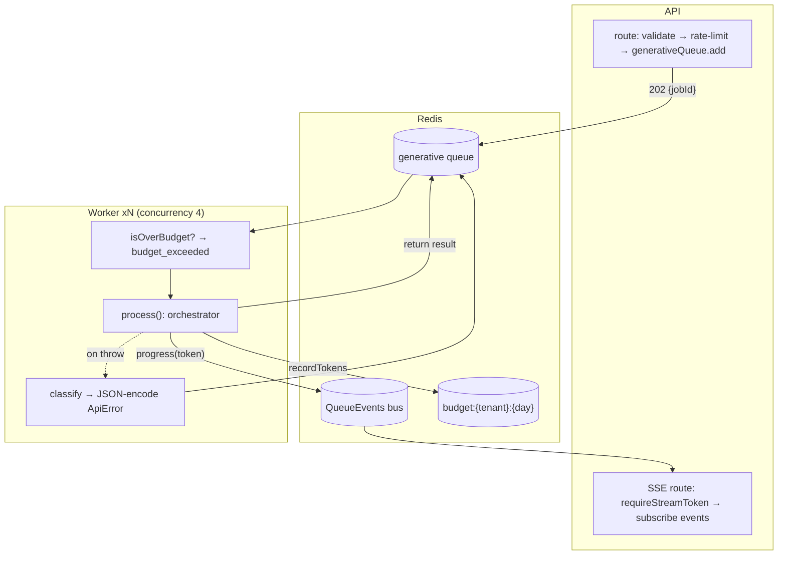
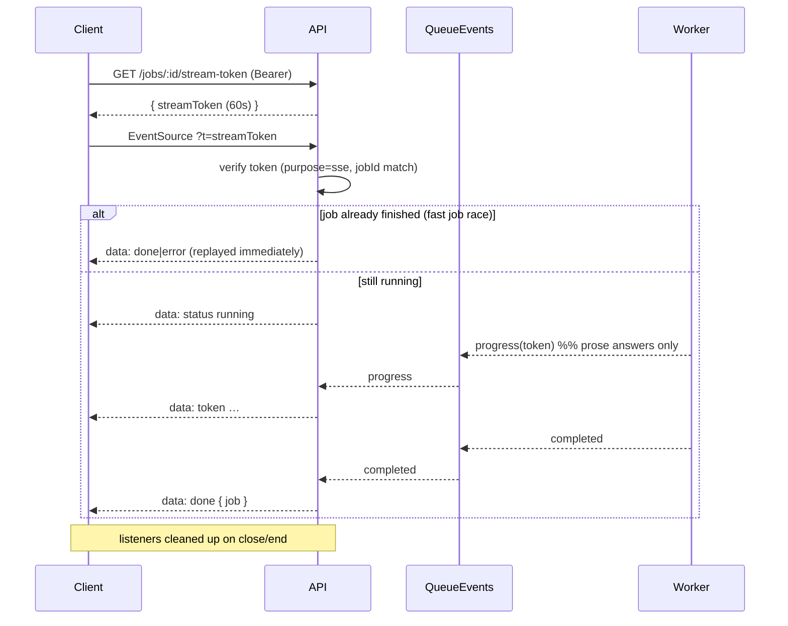
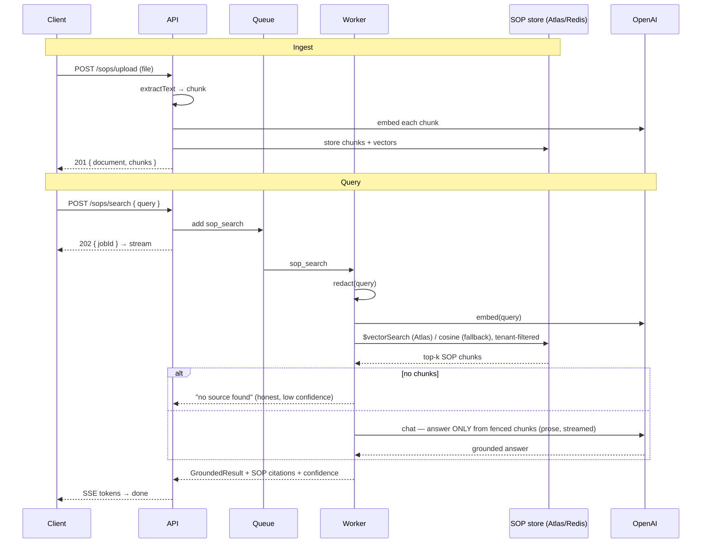
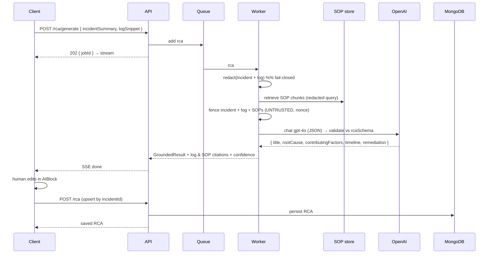

# Queue & Worker Flow

Generative work runs **off the request path**. The API enqueues a job and returns
`202 + jobId`; a separate worker process consumes the queue, runs the LLM
orchestration, and streams progress back over SSE.

- **Queue:** BullMQ on Redis, queue name `generative`.
- **Worker:** `apps/api/src/queue/worker.ts`, `concurrency: 4`, `attempts: 2`
  with exponential backoff.
- **Events bus:** a shared `QueueEvents` the SSE route subscribes to.

## Queue + worker



**Failure propagation.** BullMQ only persists a failure *message* string. The
worker classifies every failure into an `ApiError` (`redaction_failed`,
`db_unavailable`, `llm_unavailable`, `budget_exceeded`, `internal`) and
**JSON-encodes it** into the thrown error; the SSE layer (`decodeJobError`)
recovers the real `code` + `retryable`. So a non-retryable `redaction_failed`
never reaches the UI mislabelled as a retryable `internal`.

**Budget.** `isOverBudget` (Redis) is checked *before* a job spends; `recordTokens`
increments the per-tenant daily counter *after* the call. Shared across all
worker processes; fails open on a Redis error.

## SSE flow



The **already-finished check** on stream open fixes the race where a fast (mock)
job completes before the browser subscribes — the terminal event is replayed
instead of the client hanging. JSON-mode features (ticket summary, RCA) stream
**no** token events (partial JSON is useless); the UI shows "Thinking…" and
renders the structured result on `done`. Prose answers (SOP search) stream tokens.

---

## Sequence diagrams

### Ticket Summarization

```mermaid
sequenceDiagram
  participant C as Client
  participant API
  participant Q as Queue
  participant W as Worker
  participant O as OpenAI
  participant M as MongoDB

  C->>API: POST /tickets/:id/summarize (Bearer, Idempotency-Key)
  API->>M: load ticket (tenant-scoped)
  API->>Q: add ticket_summary { ticketText }
  API-->>C: 202 { jobId }
  C->>API: stream-token → EventSource
  Q->>W: ticket_summary
  W->>W: redact(ticketText)  %% fail-closed
  W->>O: chat gpt-4o-mini (JSON, fenced)
  O-->>W: { headline, summary, impact, nextActions }
  W->>W: validate vs zod; build GroundedResult
  W-->>API: completed → SSE done
  API-->>C: GroundedResult (citation + confidence + redacted)
  C->>C: human edits in AIBlock
  C->>API: PUT /tickets/:id/summary (editedByHuman)
  API->>M: upsert (unique tenantId+ticketId)
  API-->>C: saved summary
```

### SOP Search (RAG)



### RCA Generation


